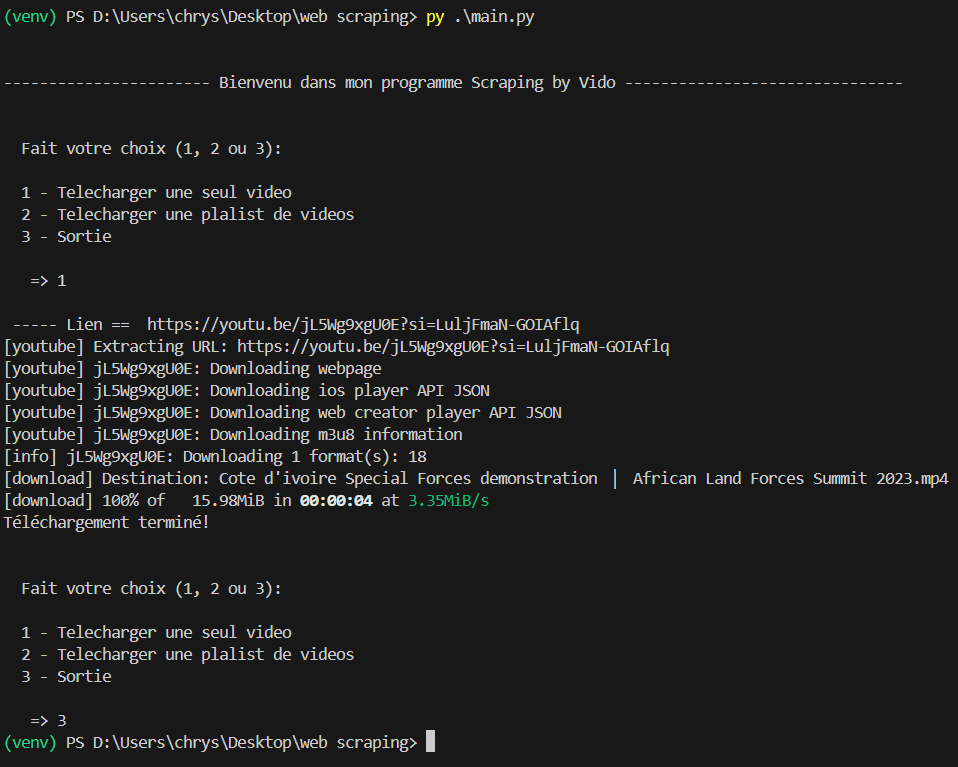

# Web Scraping Project

## Introduction

Ce projet est un script de web scraping développé en Python qui utilise diverses bibliothèques pour extraire des données d'un site web. Il peut être utilisé pour télécharger des images, du texte, et d'autres contenus disponibles sur un site spécifique.

## Aperçu



## Fonctionnalités

- Téléchargement de vidéos YouTube avec la meilleure qualité disponible.
- Téléchargement de playlists YouTube complètes.
- Gestion des fichiers téléchargés dans des dossiers spécifiques.
- Extraction d'informations supplémentaires comme le titre de la vidéo, le nombre de vues, etc.

## Prérequis

Avant d'exécuter ce projet, assurez-vous d'avoir installé les éléments suivants :

- [Python 3.11](https://www.python.org/downloads/)
- [yt-dlp](https://github.com/yt-dlp/yt-dlp)

## Installation

1. Clonez le dépôt :
   ```bash
   git clone https://github.com/ChrysDavid/web-scraping-by-Vido.git
   cd web-scraping-by-Vido
